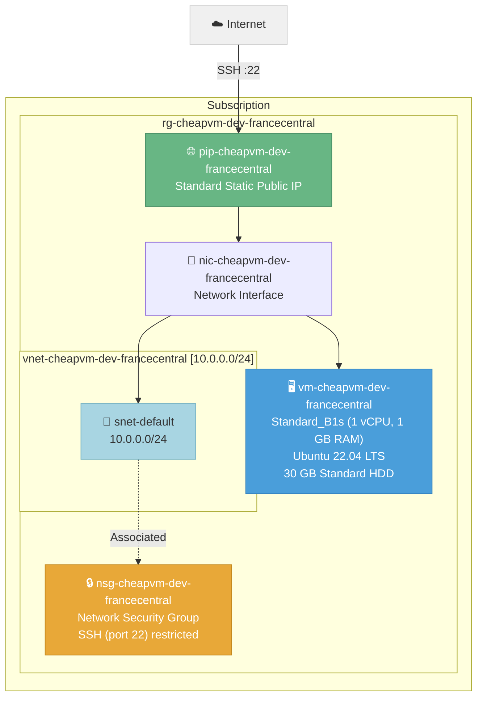

# Architecture: Cheapest VM in France Central

**Deployment ID:** `deploy-20260318-054417`
**Region:** France Central
**Environment:** dev
**Objective:** Deploy the cheapest possible Linux virtual machine

## Architecture Diagram



## Resource Inventory

| Resource | Type | Name | SKU/Size | Est. Monthly Cost |
|----------|------|------|----------|-------------------|
| Resource Group | Microsoft.Resources/resourceGroups | rg-cheapvm-dev-francecentral | — | Free |
| Network Security Group | Microsoft.Network/networkSecurityGroups | nsg-cheapvm-dev-francecentral | — | Free |
| Virtual Network | Microsoft.Network/virtualNetworks | vnet-cheapvm-dev-francecentral | — | Free |
| Subnet | (child of VNet) | snet-default | 10.0.0.0/24 | Free |
| Public IP Address | Microsoft.Network/publicIPAddresses | pip-cheapvm-dev-francecentral | Standard, Static | ~$3.65/mo |
| Network Interface | Microsoft.Network/networkInterfaces | nic-cheapvm-dev-francecentral | — | Free |
| Virtual Machine | Microsoft.Compute/virtualMachines | vm-cheapvm-dev-francecentral | Standard_B1s | ~$7.59/mo |
| OS Disk | (managed disk) | osdisk-cheapvm-dev-francecentral | 30 GB Standard HDD (S4) | ~$1.54/mo |

## Cost Summary

| Component | Estimated Monthly Cost |
|-----------|----------------------|
| VM Compute (Standard_B1s, Linux) | ~$7.59 |
| Public IP (Standard, Static) | ~$3.65 |
| OS Disk (30 GB Standard HDD) | ~$1.54 |
| Networking (VNet, NSG, NIC) | Free |
| **Total** | **~$12.78/mo** |

> **Note:** Prices are estimates based on France Central pay-as-you-go rates. Actual costs may vary.
> To reduce cost further, consider Standard_B1ls (0.5 GB RAM, ~$3.80/mo) if available in this region.

## Cost Optimization Applied

- ✅ **Cheapest reliable VM size** — Standard_B1s (1 vCPU, 1 GB RAM)
- ✅ **Free OS** — Ubuntu Server 22.04 LTS (no license cost)
- ✅ **Standard HDD** — Standard_LRS instead of Premium SSD
- ✅ **Minimal disk** — 30 GB (smallest practical size)
- ✅ **No data disks** — Only OS disk
- ✅ **Single NIC** — No redundant networking
- ✅ **No additional services** — No monitoring agents, extensions, or backup

## Security Configuration

- 🔑 SSH key authentication only (password authentication disabled)
- 🔒 NSG with SSH rule (port 22) — source IP configurable via `allowedSshSource` parameter
- ⚠️ **Action required:** Update `allowedSshSource` in parameters.json to your IP/CIDR before deploying

## SSH Access

After deployment, connect to the VM:
```bash
ssh azureuser@<public-ip-address>
```

## Pre-Deployment Checklist

- [ ] Replace `sshPublicKey` in `parameters.json` with your actual SSH public key
- [ ] Restrict `allowedSshSource` in `parameters.json` to your IP address (e.g., `"203.0.113.50/32"`)
- [ ] Review and approve the PR to trigger deployment
