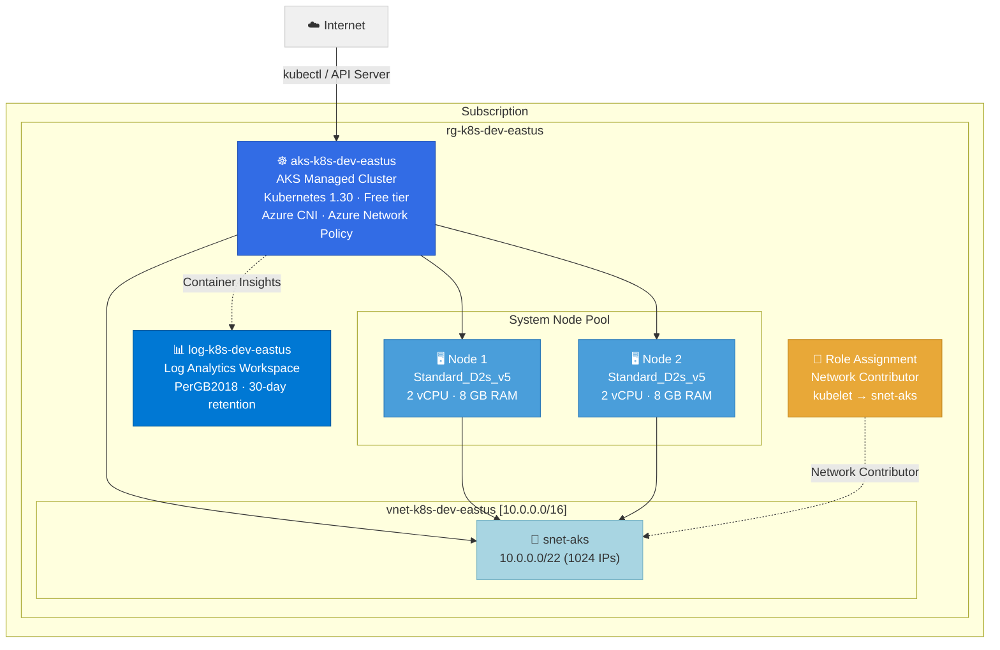

# Architecture: Azure Kubernetes Service (AKS) Cluster

**Deployment ID:** `deploy-20260331-023740`
**Region:** East US
**Environment:** dev
**Objective:** Deploy a managed Kubernetes cluster with Azure CNI networking, Container Insights monitoring, and Azure RBAC

## Architecture Diagram



## Resource Inventory

| Resource | Type | Name | SKU/Size | Est. Monthly Cost |
|----------|------|------|----------|-------------------|
| Resource Group | Microsoft.Resources/resourceGroups | rg-k8s-dev-eastus | — | Free |
| Log Analytics Workspace | Microsoft.OperationalInsights/workspaces | log-k8s-dev-eastus | PerGB2018 | ~$5.00/mo |
| Virtual Network | Microsoft.Network/virtualNetworks | vnet-k8s-dev-eastus | — | Free |
| Subnet | (child of VNet) | snet-aks | 10.0.0.0/22 | Free |
| AKS Cluster | Microsoft.ContainerService/managedClusters | aks-k8s-dev-eastus | Free tier | Free |
| Node Pool (2× Standard_D2s_v5) | (managed by AKS) | system | 2 vCPU, 8 GB RAM each | ~$140.16/mo |
| Role Assignment | Microsoft.Authorization/roleAssignments | (auto-generated GUID) | Network Contributor | Free |

## Cost Summary

| Component | Estimated Monthly Cost |
|-----------|----------------------|
| AKS Control Plane (Free tier) | Free |
| Node Pool (2× Standard_D2s_v5, Linux) | ~$140.16 |
| OS Disks (2× 128 GB P10 Managed) | ~$38.40 |
| Log Analytics (~2 GB ingestion/mo) | ~$5.00 |
| Networking (VNet, Subnet) | Free |
| **Total** | **~$183.56/mo** |

> **Note:** Prices are estimates based on East US pay-as-you-go rates. Actual costs may vary.
> To reduce cost, consider using Standard_B2s nodes (~$60/mo for 2 nodes) or enabling autoscaling with 1 min node.

## Key Configuration

- ☸️ **Kubernetes 1.30** with stable auto-upgrade channel
- 🔐 **Azure RBAC** for Kubernetes authorization (local accounts disabled)
- 🌐 **Azure CNI** networking with Azure network policy
- 📊 **Container Insights** via Log Analytics for monitoring
- 🔑 **System-assigned managed identity** (no service principal secrets)
- 🛡️ **Azure Policy** addon enabled for governance
- 🏗️ **Availability Zones** 1, 2, 3 for node pool resilience
- 🐧 **Azure Linux (Mariner)** OS for optimized container hosting

## Connecting to the Cluster

After deployment, configure `kubectl`:
```bash
az aks get-credentials --resource-group rg-k8s-dev-eastus --name aks-k8s-dev-eastus
kubectl get nodes
```

## Pre-Deployment Checklist

- [x] Region selected: East US (primary default)
- [x] Kubernetes version: 1.30 (stable)
- [x] Node size: Standard_D2s_v5 (2 vCPU, 8 GB RAM)
- [x] Node count: 2 (spread across availability zones)
- [x] Azure RBAC enabled, local accounts disabled
- [x] Container Insights configured
- [ ] Review and approve the PR to trigger deployment
