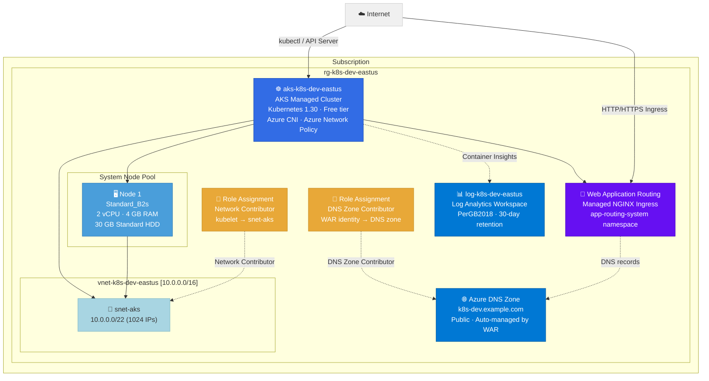

# Architecture: Azure Kubernetes Service (AKS) Cluster (Cost-Optimized)

**Deployment ID:** `deploy-20260331-023740`
**Region:** East US
**Environment:** dev
**Objective:** Deploy a managed Kubernetes cluster — cost-optimized for dev/test (1× Standard_B2s node, 30 GB Standard disk) with Web Application Routing (managed NGINX ingress + Azure DNS)

## Architecture Diagram



## Resource Inventory

| Resource | Type | Name | SKU/Size | Est. Monthly Cost |
|----------|------|------|----------|-------------------|
| Resource Group | Microsoft.Resources/resourceGroups | rg-k8s-dev-eastus | — | Free |
| Log Analytics Workspace | Microsoft.OperationalInsights/workspaces | log-k8s-dev-eastus | PerGB2018 | ~$3.05/mo |
| Azure DNS Zone | Microsoft.Network/dnsZones | k8s-dev.example.com | Public | ~$0.90/mo |
| Virtual Network | Microsoft.Network/virtualNetworks | vnet-k8s-dev-eastus | — | Free |
| Subnet | (child of VNet) | snet-aks | 10.0.0.0/22 | Free |
| AKS Cluster | Microsoft.ContainerService/managedClusters | aks-k8s-dev-eastus | Free tier | Free |
| Web Application Routing | (AKS ingressProfile) | Managed NGINX + WAR identity | — | Free |
| Node Pool (1× Standard_B2s) | (managed by AKS) | system | 2 vCPU, 4 GB RAM | ~$30.37/mo |
| OS Disk (1× 30 GB Standard HDD) | (managed by AKS) | S4 Standard_LRS | 30 GB | ~$1.54/mo |
| Role Assignment (Network Contributor) | Microsoft.Authorization/roleAssignments | (auto-generated GUID) | kubelet → snet-aks | Free |
| Role Assignment (DNS Zone Contributor) | Microsoft.Authorization/roleAssignments | (auto-generated GUID) | WAR identity → DNS zone | Free |

## Cost Summary

| Component | Estimated Monthly Cost |
|-----------|----------------------|
| AKS Control Plane (Free tier) | Free |
| Node Pool (1× Standard_B2s, Linux) | ~$30.37 |
| OS Disk (30 GB Standard HDD) | ~$1.54 |
| Log Analytics (~1.1 GB ingestion/mo) | ~$3.05 |
| Azure DNS Zone | ~$0.90 |
| Networking (VNet, Subnet) | Free |
| Web Application Routing (managed) | Free |
| **Total** | **~$35.86/mo** |
| **Savings vs. original ($183.56/mo)** | **-$147.70/mo (80%)** |

> **Note:** Prices are estimates based on East US pay-as-you-go rates. Actual costs may vary.
> Standard_B2s is a burstable VM — suitable for dev/test. For production, use Standard_D2s_v5 + 2+ nodes + Standard tier.

## Cost Optimizations Applied

- ✅ **Burstable VM (Standard_B2s)** — $0.042/hr vs $0.096/hr for D2s_v5 (56% cheaper per node)
- ✅ **Single node** — 1 node instead of 2; no HA needed for dev
- ✅ **30 GB Standard HDD** — minimum OS disk size with Standard_LRS (not Premium)
- ✅ **No availability zones** — single node, so zone-spreading removed
- ✅ **AKS Free tier** — no control plane cost (no SLA)

## Key Configuration

- ☸️ **Kubernetes 1.30** with stable auto-upgrade channel
- 🔐 **Azure RBAC** for Kubernetes authorization (local accounts disabled)
- 🌐 **Azure CNI** networking with Azure network policy
- 📊 **Container Insights** via Log Analytics for monitoring
- 🔑 **System-assigned managed identity** (no service principal secrets)
- 🛡️ **Azure Policy** addon enabled for governance
- 🐧 **Azure Linux (Mariner)** OS for optimized container hosting
- 🔀 **Web Application Routing** — managed NGINX ingress controller (`app-routing-system` namespace); auto-creates DNS records in the Azure DNS zone when you apply an `Ingress` resource

## Web Application Routing

WAR is the recommended AKS-native ingress solution. Once deployed:

1. **Delegate your domain** — Point your registrar's NS records to the Azure DNS nameservers output by this deployment:
   ```bash
   az network dns zone show -g rg-k8s-dev-eastus -n k8s-dev.example.com --query nameServers
   ```

2. **Create an Ingress** — WAR automatically provisions a public load balancer IP and creates DNS records:
   ```yaml
   apiVersion: networking.k8s.io/v1
   kind: Ingress
   metadata:
     name: my-app
     annotations:
       kubernetes.azure.com/tls-cert-keyvault-uri: ""  # optional: Key Vault cert
   spec:
     ingressClassName: webapprouting.kubernetes.azure.com
     rules:
     - host: my-app.k8s-dev.example.com
       http:
         paths:
         - path: /
           pathType: Prefix
           backend:
             service:
               name: my-app-svc
               port:
                 number: 80
   ```

3. **Check status:**
   ```bash
   kubectl get ingress -A
   kubectl get nginxingresscontroller -n app-routing-system
   ```

> **DNS zone name** — Update `dnsZoneName` in `parameters.json` to your actual domain before deployment.

## ⚠️ Dev-Only Configuration

This configuration is **not suitable for production**:
- Single node = no HA (node failure = cluster outage)
- Standard_B2s = burstable CPU (unpredictable performance under sustained load)
- Free tier = no SLA
- No availability zones

For production: switch to 3× Standard_D2s_v5 + AKS Standard tier + availability zones (~$290/mo).

## Connecting to the Cluster

After deployment, configure `kubectl`:
```bash
az aks get-credentials --resource-group rg-k8s-dev-eastus --name aks-k8s-dev-eastus
kubectl get nodes
kubectl get pods -n app-routing-system   # verify WAR is running
```

## Pre-Deployment Checklist

- [x] Region selected: East US (primary default)
- [x] Kubernetes version: 1.30 (stable)
- [x] Node size: Standard_B2s (2 vCPU, 4 GB RAM — cost-optimized for dev)
- [x] Node count: 1 (single node, dev-only)
- [x] Azure RBAC enabled, local accounts disabled
- [x] Container Insights configured
- [x] Web Application Routing (managed NGINX ingress) enabled
- [x] Azure DNS Zone provisioned with DNS Zone Contributor RBAC for WAR identity
- [ ] **Update `dnsZoneName` in parameters.json to your actual domain**
- [ ] Delegate domain NS records to Azure DNS nameservers (post-deploy)
- [ ] Review and approve the PR to trigger deployment
