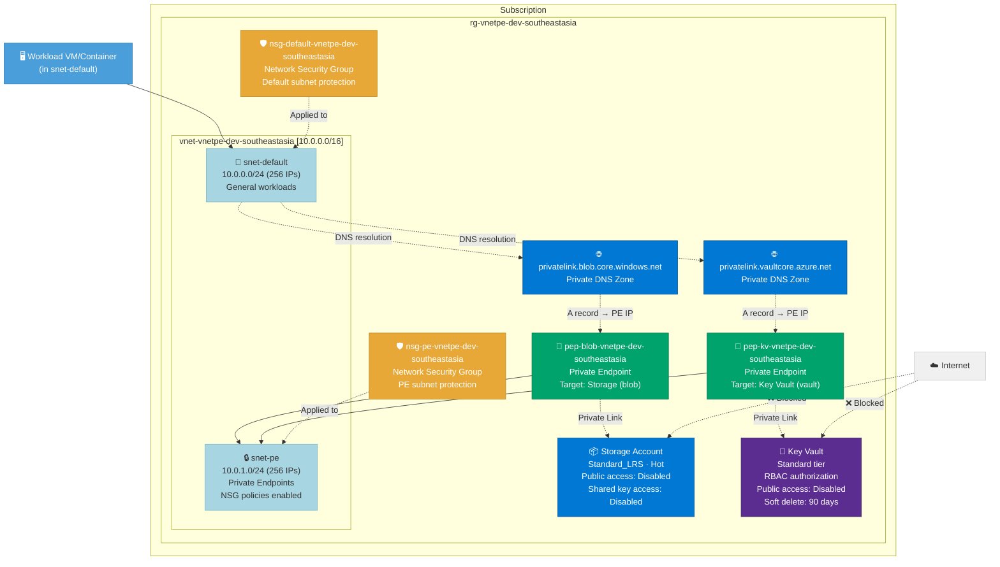

# Architecture: Virtual Network with Private Endpoints

**Deployment ID:** `deploy-20260402-032020`
**Region:** Southeast Asia
**Environment:** dev
**Objective:** Deploy a Virtual Network with Private Endpoints for a Storage Account (blob) and a Key Vault. All PaaS services have public network access disabled and are reachable only via private endpoints with integrated Private DNS Zones for automatic name resolution.

## Architecture Diagram



## Network Flow

```
Workload (snet-default) → DNS query for *.blob.core.windows.net
    → Private DNS Zone resolves to PE private IP (10.0.1.x)
    → Traffic flows to snet-pe → Private Endpoint → Storage Account
    
Workload (snet-default) → DNS query for *.vault.azure.net
    → Private DNS Zone resolves to PE private IP (10.0.1.x)
    → Traffic flows to snet-pe → Private Endpoint → Key Vault
    
Internet → Storage Account public endpoint → ❌ DENIED (publicNetworkAccess: Disabled)
Internet → Key Vault public endpoint → ❌ DENIED (publicNetworkAccess: Disabled)
```

## Resource Inventory

| Resource | Type | Name | SKU/Config | Est. Monthly Cost |
|----------|------|------|------------|-------------------|
| Resource Group | Microsoft.Resources/resourceGroups | rg-vnetpe-dev-southeastasia | — | Free |
| NSG (default) | Microsoft.Network/networkSecurityGroups | nsg-default-vnetpe-dev-southeastasia | — | Free |
| NSG (PE) | Microsoft.Network/networkSecurityGroups | nsg-pe-vnetpe-dev-southeastasia | — | Free |
| Virtual Network | Microsoft.Network/virtualNetworks | vnet-vnetpe-dev-southeastasia | 10.0.0.0/16 | Free |
| Subnet (default) | (child of VNet) | snet-default | 10.0.0.0/24 | Free |
| Subnet (PE) | (child of VNet) | snet-pe | 10.0.1.0/24 | Free |
| Storage Account | Microsoft.Storage/storageAccounts | stvnetpedev\<unique\> | Standard_LRS | ~$0.00 |
| Key Vault | Microsoft.KeyVault/vaults | kv-vnetpe-dev-\<unique\> | Standard | ~$0.03 |
| PE (blob) | Microsoft.Network/privateEndpoints | pep-blob-vnetpe-dev-southeastasia | blob | ~$7.30 |
| PE (Key Vault) | Microsoft.Network/privateEndpoints | pep-kv-vnetpe-dev-southeastasia | vault | ~$7.30 |
| DNS Zone (blob) | Microsoft.Network/privateDnsZones | privatelink.blob.core.windows.net | — | ~$0.50 |
| DNS Zone (vault) | Microsoft.Network/privateDnsZones | privatelink.vaultcore.azure.net | — | ~$0.50 |
| VNet Link (blob) | privateDnsZones/virtualNetworkLinks | vnet-...-link | — | Free |
| VNet Link (vault) | privateDnsZones/virtualNetworkLinks | vnet-...-link | — | Free |
| DNS Zone Group (blob) | privateEndpoints/privateDnsZoneGroups | default | — | Free |
| DNS Zone Group (vault) | privateEndpoints/privateDnsZoneGroups | default | — | Free |

## Cost Summary

| Component | Estimated Monthly Cost |
|-----------|----------------------|
| Private Endpoint (blob) | ~$7.30 |
| Private Endpoint (Key Vault) | ~$7.30 |
| Private DNS Zone (blob) | ~$0.50 |
| Private DNS Zone (vault) | ~$0.50 |
| Key Vault operations | ~$0.03 |
| VNet, Subnets, NSGs, VNet Links | Free |
| Storage Account (no data) | Free |
| **Total** | **~$15.63/mo** |

> **Note:** Prices are estimates based on Southeast Asia pay-as-you-go rates. Private endpoints are the primary cost driver. Actual data transfer and operations costs vary with usage.

## Key Security Configuration

- 🔒 **Public network access disabled** on both Storage Account and Key Vault — accessible only via private endpoints
- 🛡️ **NSGs applied** to both subnets — including the PE subnet via `privateEndpointNetworkPolicies: NetworkSecurityGroupEnabled`
- 🔑 **Key Vault RBAC authorization** — no access policies, uses Azure RBAC for fine-grained access control
- 🗑️ **Soft delete enabled** on Key Vault — 90-day retention with purge protection
- 🚫 **Shared key access disabled** on Storage — forces Azure AD authentication
- 🚫 **Blob public access disabled** on Storage — no anonymous container/blob access
- 🔐 **TLS 1.2 minimum** on Storage Account
- 🌐 **Private DNS Zones** with VNet links — automatic DNS resolution for private endpoint IPs

## How Private Endpoints Work

1. **Private Endpoint** creates a network interface in the PE subnet with a private IP from 10.0.1.0/24
2. **Private DNS Zone** contains an A record mapping `<storage-name>.blob.core.windows.net` → PE private IP
3. **VNet Link** connects the DNS zone to the VNet so all VMs/containers in the VNet resolve the private IP
4. **DNS Zone Group** on the PE auto-manages the A record (creates/updates/deletes) as the PE lifecycle changes

Result: Any workload in the VNet that accesses `<storage-name>.blob.core.windows.net` is transparently routed to the private endpoint IP, never leaving the Azure backbone network.

## Post-Deployment: Adding Workloads

Deploy VMs, containers, or other compute into `snet-default` to access the private-linked services:

```bash
# Verify private endpoint DNS resolution from a VM in the VNet
nslookup <storage-account-name>.blob.core.windows.net
# Expected: resolves to 10.0.1.x (private IP)

nslookup <key-vault-name>.vault.azure.net
# Expected: resolves to 10.0.1.x (private IP)
```

## Pre-Deployment Checklist

- [x] Region selected: Southeast Asia
- [x] VNet address space: 10.0.0.0/16 with dedicated PE subnet
- [x] Storage Account: public access disabled, shared key disabled, HTTPS-only, TLS 1.2
- [x] Key Vault: RBAC authorization, soft delete, purge protection, public access disabled
- [x] Private DNS Zones configured for blob and vault
- [x] VNet Links connect DNS zones to VNet
- [x] DNS Zone Groups auto-manage A records on private endpoints
- [x] NSGs applied to both subnets
- [ ] Review and approve the PR to trigger deployment
