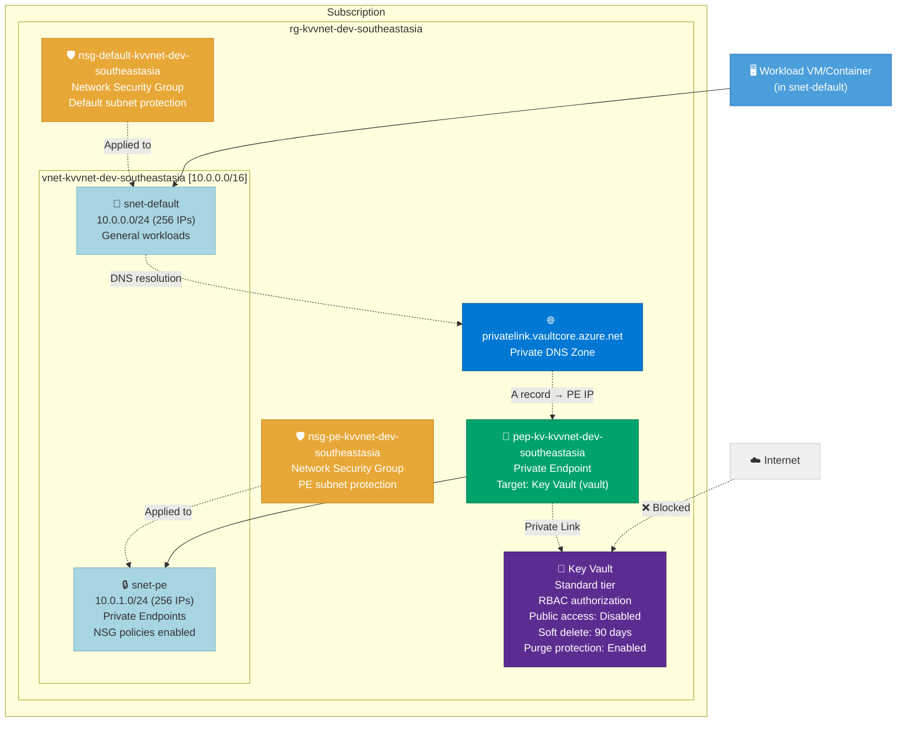

# Architecture: Key Vault with VNet Integration

**Deployment ID:** `deploy-20260406-063445`
**Region:** Southeast Asia
**Environment:** dev
**Objective:** Deploy an Azure Key Vault with VNet integration via a Private Endpoint. The Key Vault has public network access disabled and is reachable only through a private endpoint with an integrated Private DNS Zone for automatic name resolution.

## Architecture Diagram



## Network Flow

```
Workload (snet-default) → DNS query for *.vault.azure.net
    → Private DNS Zone resolves to PE private IP (10.0.1.x)
    → Traffic flows to snet-pe → Private Endpoint → Key Vault
    
Internet → Key Vault public endpoint → ❌ DENIED (publicNetworkAccess: Disabled)
```

## Resource Inventory

| Resource | Type | Name | SKU/Config | Est. Monthly Cost |
|----------|------|------|------------|-------------------|
| Resource Group | Microsoft.Resources/resourceGroups | rg-kvvnet-dev-southeastasia | — | Free |
| NSG (default) | Microsoft.Network/networkSecurityGroups | nsg-default-kvvnet-dev-southeastasia | — | Free |
| NSG (PE) | Microsoft.Network/networkSecurityGroups | nsg-pe-kvvnet-dev-southeastasia | — | Free |
| Virtual Network | Microsoft.Network/virtualNetworks | vnet-kvvnet-dev-southeastasia | 10.0.0.0/16 | Free |
| Subnet (default) | (child of VNet) | snet-default | 10.0.0.0/24 | Free |
| Subnet (PE) | (child of VNet) | snet-pe | 10.0.1.0/24 | Free |
| Key Vault | Microsoft.KeyVault/vaults | kv-kvvnet-dev-\<unique\> | Standard | ~$0.03 |
| PE (Key Vault) | Microsoft.Network/privateEndpoints | pep-kv-kvvnet-dev-southeastasia | vault | ~$7.30 |
| DNS Zone (vault) | Microsoft.Network/privateDnsZones | privatelink.vaultcore.azure.net | — | ~$0.50 |
| VNet Link (vault) | privateDnsZones/virtualNetworkLinks | vnet-...-link | — | Free |
| DNS Zone Group (vault) | privateEndpoints/privateDnsZoneGroups | default | — | Free |

## Cost Summary

| Component | Estimated Monthly Cost |
|-----------|----------------------|
| Private Endpoint (Key Vault) | ~$7.30 |
| Private DNS Zone (vault) | ~$0.50 |
| Key Vault operations | ~$0.03 |
| VNet, Subnets, NSGs, VNet Links | Free |
| **Total** | **~$7.83/mo** |

> **Note:** Prices are estimates based on Southeast Asia pay-as-you-go rates. The private endpoint is the primary cost driver. Actual Key Vault operations costs vary with usage ($0.03/10K operations).

## Key Security Configuration

- 🔒 **Public network access disabled** on Key Vault — accessible only via private endpoint
- 🛡️ **NSGs applied** to both subnets — including the PE subnet via `privateEndpointNetworkPolicies: NetworkSecurityGroupEnabled`
- 🔑 **Key Vault RBAC authorization** — no access policies, uses Azure RBAC for fine-grained access control
- 🗑️ **Soft delete enabled** on Key Vault — 90-day retention with purge protection
- 🔐 **Network ACLs default deny** with Azure Services bypass
- 🌐 **Private DNS Zone** with VNet link — automatic DNS resolution for private endpoint IP

## How Private Endpoints Work

1. **Private Endpoint** creates a network interface in the PE subnet with a private IP from 10.0.1.0/24
2. **Private DNS Zone** contains an A record mapping `<key-vault-name>.vault.azure.net` → PE private IP
3. **VNet Link** connects the DNS zone to the VNet so all VMs/containers in the VNet resolve the private IP
4. **DNS Zone Group** on the PE auto-manages the A record (creates/updates/deletes) as the PE lifecycle changes

Result: Any workload in the VNet that accesses `<key-vault-name>.vault.azure.net` is transparently routed to the private endpoint IP, never leaving the Azure backbone network.

## Post-Deployment: Adding Workloads

Deploy VMs, containers, or other compute into `snet-default` to access the Key Vault:

```bash
# Verify private endpoint DNS resolution from a VM in the VNet
nslookup <key-vault-name>.vault.azure.net
# Expected: resolves to 10.0.1.x (private IP)
```

## Pre-Deployment Checklist

- [x] Region selected: Southeast Asia
- [x] VNet address space: 10.0.0.0/16 with dedicated PE subnet
- [x] Key Vault: RBAC authorization, soft delete, purge protection, public access disabled
- [x] Private DNS Zone configured for vault
- [x] VNet Link connects DNS zone to VNet
- [x] DNS Zone Group auto-manages A records on private endpoint
- [x] NSGs applied to both subnets
- [ ] Review and approve the PR to trigger deployment
