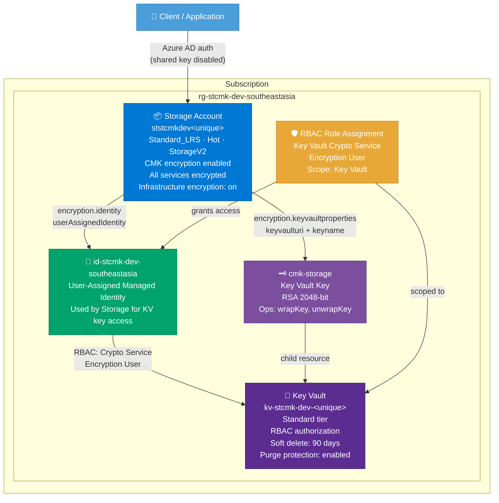

# Architecture: Storage Account with Customer-Managed Keys (CMK)

**Deployment ID:** `deploy-20260407-020000`
**Region:** Southeast Asia
**Environment:** dev
**Objective:** Deploy a Storage Account encrypted with customer-managed keys (CMK) stored in Azure Key Vault, using a User-Assigned Managed Identity for key access with RBAC authorization.

## Architecture Diagram



## CMK Encryption Flow

```
Client writes data to Storage Account
    → Storage Account encrypts data using account-level encryption key
    → Account encryption key is wrapped (encrypted) by the CMK key in Key Vault
    → Storage Account uses User-Assigned Managed Identity to call Key Vault
    → Managed Identity has "Key Vault Crypto Service Encryption User" role
    → Key Vault performs wrapKey/unwrapKey operations via the RSA 2048 key
    → Data is encrypted at rest with customer-managed key

On read:
    → Storage Account calls Key Vault to unwrap the account encryption key
    → Data is decrypted and returned to the client
```

## Deployment Sequence

The deployment is split into two nested deployments to handle dependencies correctly:

```
1. Subscription-level: Create Resource Group
       │
       ▼
2. keyVaultAndIdentityDeployment (nested, inner scope):
   a. User-Assigned Managed Identity
   b. Key Vault (with soft delete + purge protection)
   c. RBAC Role Assignment (Crypto Service Encryption User → Identity → KV)
   d. Key Vault Key (cmk-storage, RSA 2048)
       │
       ▼
3. storageAccountDeployment (nested, inner scope):
   a. Storage Account with CMK encryption referencing:
      - Identity from step 2a
      - Key Vault URI from step 2b
      - Key name from step 2d
```

## Resource Inventory

| Resource | Type | Name | SKU/Config | Est. Monthly Cost |
|----------|------|------|------------|-------------------|
| Resource Group | Microsoft.Resources/resourceGroups | rg-stcmk-dev-southeastasia | — | Free |
| Managed Identity | Microsoft.ManagedIdentity/userAssignedIdentities | id-stcmk-dev-southeastasia | — | Free |
| Key Vault | Microsoft.KeyVault/vaults | kv-stcmk-dev-\<unique\> | Standard | ~$0.03 |
| Key Vault Key | Microsoft.KeyVault/vaults/keys | cmk-storage | RSA 2048 | ~$1.00 |
| RBAC Assignment | Microsoft.Authorization/roleAssignments | (GUID) | Crypto Service Encryption User | Free |
| Storage Account | Microsoft.Storage/storageAccounts | ststcmkdev\<unique\> | Standard_LRS, Hot | ~$0.00 |

## Cost Summary

| Component | Estimated Monthly Cost |
|-----------|----------------------|
| Key Vault operations | ~$0.03 |
| Key Vault key (software-protected) | ~$1.00 |
| Storage Account (no data) | Free |
| Managed Identity | Free |
| RBAC Assignment | Free |
| Resource Group | Free |
| **Total** | **~$1.03/mo** |

> **Note:** Prices are estimates based on Southeast Asia pay-as-you-go rates. Key Vault key cost is ~$1/key/month for software-protected RSA keys. Storage costs scale with data stored ($0.02/GB/month hot tier). Key Vault operations billed at $0.03/10K operations.

## Key Security Configuration

- 🔑 **Customer-Managed Key (CMK)** encryption on Storage Account — all four services (blob, file, table, queue) encrypted
- 🔒 **Infrastructure encryption** (double encryption) enabled — data encrypted with two different encryption algorithms
- 🛡️ **RBAC authorization** on Key Vault — no access policies, uses Azure RBAC for fine-grained access control
- 🗑️ **Soft delete** enabled on Key Vault — 90-day retention with purge protection (required for CMK)
- 🔐 **User-Assigned Managed Identity** — no credentials stored, identity-based access to Key Vault
- 🚫 **Shared key access disabled** on Storage — forces Azure AD authentication
- 🚫 **Blob public access disabled** — no anonymous container/blob access
- 🔐 **TLS 1.2 minimum** on Storage Account
- 🔐 **HTTPS-only** traffic on Storage Account
- 🛡️ **Network ACLs** default deny with Azure Services bypass on Storage Account
- 🛡️ **Key Vault Crypto Service Encryption User** role — least-privilege RBAC for CMK operations (wrapKey/unwrapKey only)

## Pre-Deployment Checklist

- [x] Region selected: Southeast Asia
- [x] User-Assigned Managed Identity created for CMK access
- [x] Key Vault: RBAC authorization, soft delete (90 days), purge protection enabled
- [x] Key Vault Key: RSA 2048-bit with wrapKey/unwrapKey operations
- [x] RBAC: Key Vault Crypto Service Encryption User role assigned to managed identity
- [x] Storage Account: CMK encryption configured for all services
- [x] Storage Account: Infrastructure encryption (double encryption) enabled
- [x] Storage Account: Shared key access disabled, blob public access disabled
- [x] Storage Account: HTTPS-only, TLS 1.2, network ACLs default deny
- [ ] Review and approve the PR to trigger deployment
